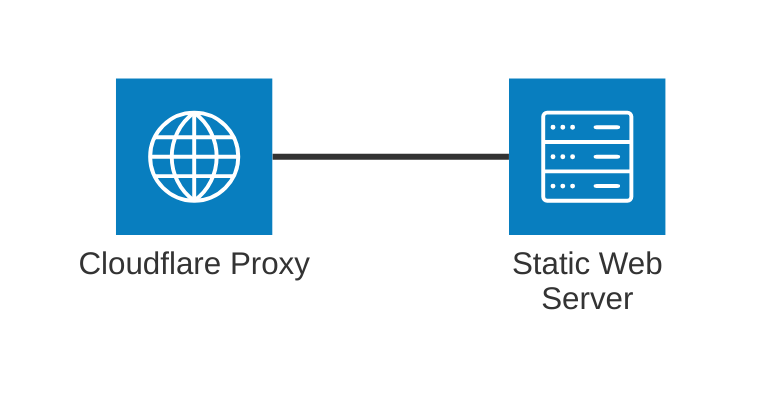

+++
title = "Setting up rijkt.link"
date = 2025-04-27
[taxonomies]
tags = ["meta", "documentation"]
+++

This is a documentation post, for my future sanity's sake. If you too are interested in setting up your own website with an *SSG* like *Zola*, keep reading.  <!-- more --> All source code is available on [GitHub](https://github.com/rijkt/rijkt.link). 

## System Goals

I want to be able to write and publish text in a me-friendly way, as I am the only user. The content should be separated from the chosen presentation technology. There is no need for interactivity outside of basic navigation and maybe commenting. It should be possible to host everything on my own, to avoid vendor lock-in.

Since I recently switched my note-taking over from *org-mode* to Markdown, I would like the system to support it. I don't want to write inside an HTML file. The system should also be extensible and using a backend I'm interested learning, i.e. no *PHP*, *Node* or *Go*. 

I might want to publish some notes in German, others in English. Support for multiple languages would enable this more easily.

The design should be open for me to tinker with. I will not, however, design something from scratch. 

## DNS

### rijkt.link

Choosing a domain is probably what took me longest in this post. I avoided country TLDs after the most recent political upset affecting a [popular development TLD](https://en.wikipedia.org/wiki/.io#Possible_phasing_out). Choosing one that wasn't prohibitively expensive but still sounded dev/webby took a while and https://tld-list.com/ helped. I landed on `.link`, but this was pretty arbitrary.

I purchased `rijkt.link` using *Cloudflare* after looking at cheaper but more sketchy options. This turned out to be quite practical, as I now host everything related to the website on a single provider.
### Email

While I was at it, I also set up a custom email for this domain. This was relatively straightforward using *Proton Mail*, just had to add eight DNS records:
- TXT proof of ownership
- MX records for routing
- TXT Sender Policy Framework (SPF) for authentication
- CNAME DomainKeys Identified Mail (DKIM) for keys
-  TXT DMARC for verifying sender information

With that you're reading the words of the proud owner of [pascal@rijkt.link](mailto:pascal@rijkt.link).

## CloudFlare

The resulting setup is quite simple. A CNAME entry points to an internal *Cloudflare* domain belonging to the *Cloudflare Page*. The internal domain is fronted by *Cloudflare Proxy*, which adds DDoS protection, metrics and the like.




## Zola
Zola is a static site generator written in Rust. It has many [themes](https://www.getzola.org/themes/), [Linkita](https://codeberg.org/salif/linkita) is the one I'm using. It is based on [Kita](https://github.com/st1020/kita) and adds multi-language support.

My reasoning for using Zola over more broadly supported alternatives mainly boils down to Zola using Rust. If I ever want to write an extension I would prefer using Rust over e.g. Ruby.

## Repository Setup

The *Git* repo is easily created using `zola init`. For easier building, the theme is located inside the repository as well. Instead of a package management system, the install is done via *Git* submodules. To add a new submodule run 

```
git submodule add <theme git repo> theme/<theme name>
```

When cloning the repository, the submodule has to be cloned as well. This is accomplished using the commands
```
 git submodule init
 git submodule update 
```
Versioning is handled with tags on the theme repository.
## Deployment
At time of writing, *Zola* is no longer properly supported for *Cloudflare Page's* *Git* repository integration. Trying to deploy with the `v2` build systems fails due to *Zola* being unavailable. Per the docs `v1` still supports *Zola*, but only up to version `0.14.0`. I'm currently running `0.20.0` locally. That version mismatch is a source of error's I'm not willing to debug if the worst comes to pass.

Automatic deployment via *Cloudflare* would have been convenient, but inverting the dependency here is nicer in practice. Therefore I simply deploy from a GitHub action. This still needs to be implemented at time of writing - [coming soon](https://github.com/rijkt/rijkt.link/issues/3).
## Credits

Reading [vale.rocks](https://vale.rocks/) and [gwern.net](https://gwern.net/) greatly inspired me to have a presence of my own on the web. [Zola](https://www.getzola.org/) and [Linkita](https://codeberg.org/salif/linkita) allowed me to get something off the ground quickly.

## Closing remarks

This is my first attempt at setting up something like this. For work I am more used to big enterprise applications with Single Page front-ends. So if you have any suggestions, feel free to write me at email at [pascal@rijkt.link](mailto:pascal@rijkt.link). Maybe at some point I'll even have a comment feature.