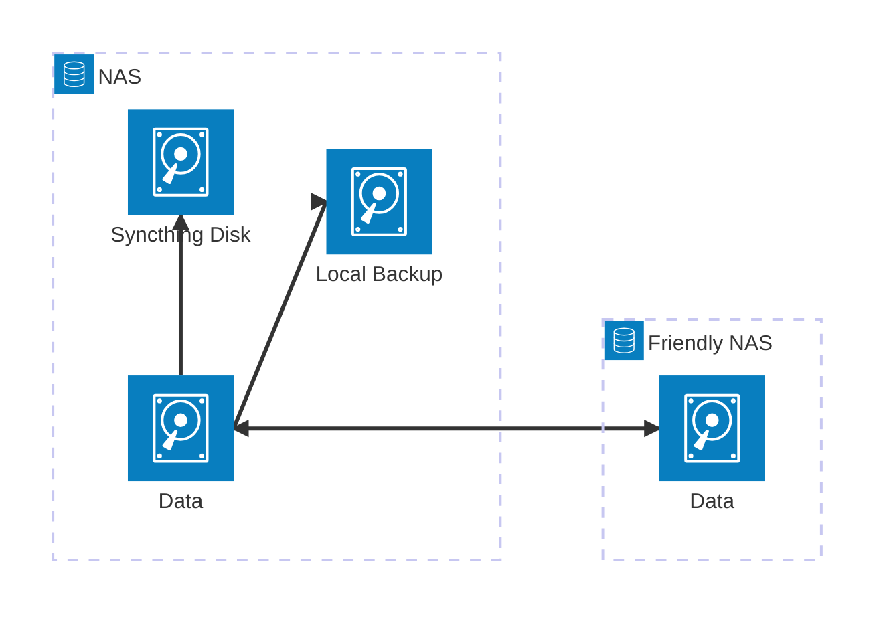

+++
title = "Backup Write-up"
date = 2025-05-14
[taxonomies]
tags = ["self-hosting", "documentation"]
+++

✨How to set up geo-redundant backups with your friends✨ <!-- more --> This is something I first started to write back in 2023.

# Pain Points

This holiday season I sought to address some issues in my home setup. I experienced a lot of friction in using multiple computers and trying to avoid Cloud Services like those offered by Google. In the past I was content storing all my personal data on the desktop I used as a daily driver. By now I mostly work on my Laptop and am used to accessing everything from my phone as well. Everything except important or personal files that still sat on my desktop on an encrypted drive.

The drive encryption stems from an attempt to devise a feasible backup strategy a few years back. I used to clone the encrypted drive onto an external one and store that in my closet. I needed to encrypt everything, you see, in case the loose drive ever got away. This introduced more complexity and friction in accessing my data on the desktop. The approach of manual backups was a bit fiddly and required planning and motivated effort.

Because of this I've been living without functional backups for quite some time. The existential dread of losing everything because of hardware failure or many, many other imagined horrors were another key motivator in this project. Striking a balance between ease of use and paranoia. A theme in all my self-hosting.

# Goals

I want to have an automated backup solution that is independent from big cloud providers. It should be independent from vendors (use _FOSS_ when possible). Automate everything.

# Reducing Complexity

As I like to do it in my programming practice, I first tried simplifying the data I had to work with. It was the season of reflecting and letting things go, so I deleted a whole lot. Over so many years, a lot of duplicates sneak in as well. I got rid of those using `fdupes`.

Next, I centralized. Instead of having my data spread on multiple devices, I moved everything from documents to _Bandcamp_ purchases to one data store. I started out using an old computer as a makeshift server, but replaced it during this effort. I landed on a _Synology NAS_ to reduce maintenance effort. This move eliminated the process of copying the target data to a backup location, as it is now already stored on the same device.

# Solution

Clients store what they need locally. Working data that needs to be shared is put into a directory managed by _Syncthing_. _Syncthing_ works as a decentral, self-hosted alternative to Google Drive. All my devices run it and use it to sync selected files between them. it works especially well with a service that is always on and hosts all shared repositories.

Shared data lives centralized and de-duplicated data on my home _NAS_. Everything is kept in a volume with _SHR (Synology Hybrid RAID)_ backed by two disks to mitigate drive failure. The volume also uses `btrfs`, so I could theoretically reset an accidental deletion of some important file.

There is a second volume with a single dedicated disk disk for cloning all my data. This is the actual backup. It lives on the same device to make automation as easy as possible. The backup is done on a per-folder basis with a _Synology_ tool, _Hyper Backup_. It runs daily and informs me about failures, which let's me sleep easy. At this point the data is stored redundantly, but will not survive a house fire. That is where the power of friendship comes in.




The third volume with one dedicated disk contains a `restic` repository with a minimal set of important data that is synced to a friend's home server via _Syncthing_. In return I also have his backup on that same disk. To ensure privacy in transit and at rest, `restict` encrypts all data put into a repository. To save space only diffs are persisted when pushing updates. Unused data can be pruned periodically. The third volume also contains all other Syncthing folder.

At the time of writing, _Synology_ does not have native `restic` support. In order to automate these backups, I rely on a container that is run periodically to archive select folders. Syncthing also runs in a container.








# Conclusion

The final piece in the puzzle to achieve true geo-redundancy was achieved this year, when I moved into a new town. Now even earthquakes won't touch my backup. Next step: shoot my NAS into space.

Feel much more inclined to read manga (easily accessible).
Having a NAS opens up new automation possibilites.

# Open Issues

Data in syncthing has to be moved manually (eg. photos).
maximising btrfs potential
send/receive?
restic/syncthing introduces redundancy (the bad kind). How to privately and easily send backups to friends' server?
need to update and maintain restic container
